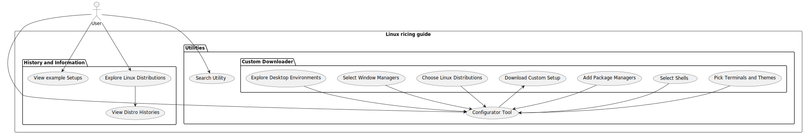

# Linux Ricing

## About

School project for WMC. Guide to ricing linux systems

[Project Description](./project-description.md)

## Hosting

[Pages](https://julian-mostbauer.github.io/LinuxRicingGuide/)

Deploy Status:

